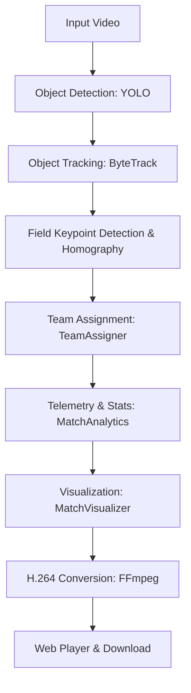
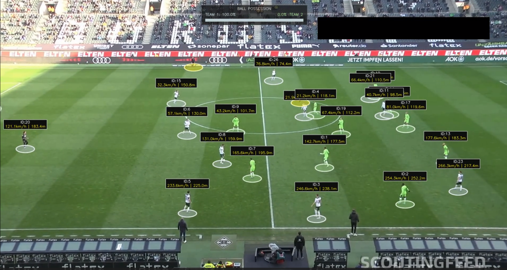
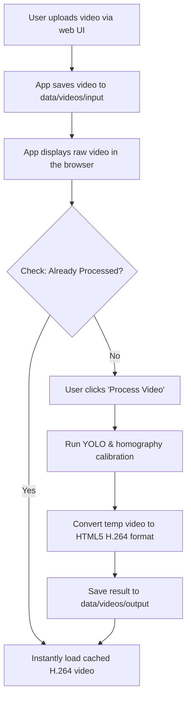

# AI Football Match Analyzer

An advanced, modular, AI-powered sports analytics platform. This system utilizes a custom YOLO object detection model, Roboflow pitch keypoint calibration, homography perspective projection, and object tracking to extract high-fidelity spatial telemetry from raw broadcast football footage.

---

## Key Features
- **Multi-Object Detection & Tracking**: Tracks players, referees, and the match ball dynamically across frames using YOLO and ByteTrack.
- **Goalkeeper Team Assignment**: Intelligently clusters outfield players using K-Means color clustering and assigns goalkeepers to the correct team based on average spatial proximity.
- **Camera Calibration & Homography**: Estimates camera movement and maps image coordinates to a 2D football pitch view, enabling speed and distance estimation in meters.
- **Dynamic Possession Analytics & HUD**: Calculates real-time team possession based on the proximity of players to the ball, displaying a dynamic HUD styled with the exact colors of the active teams.
- **Cached Processing Optimization**: Automatically saves uploaded and processed videos locally. If a video has been analyzed before, the app skips processing and serves the cached H.264 video instantly.

---

## System Design & Architecture



### Pipeline Flow Detail
1. **Object Detection**: YOLO detects players, referees, and the ball.
2. **Object Tracking**: ByteTrack assigns persistent tracking IDs to all detected objects.
3. **Camera Homography**: Roboflow Pitch Detector identifies field keypoints to estimate camera posture, converting pixel coordinates to a standardized 2D pitch template.
4. **Team Assignment**: Color features are extracted from player jerseys to cluster them into Team 1 and Team 2. Goalkeepers are resolved to their matching team by calculating the closest average distance to outfield teammates.
5. **Match Analytics**: Calculates individual player running speed, total distance covered in meters, and tracks team possession dynamically.
6. **Visualization**: Overlays tactical bounding boxes, speed tags, possession bars, and maps positions onto a mini 2D tactical pitch.
7. **H.264 Rendering**: Converts the OpenCV video stream using FFmpeg to ensure native compatibility with web browsers.

---

## Sample Visualizations & Pipeline Output

Here is a visual sample of the telemetry and tactical tracking pipeline output:



---

## Video Processing Flow

The step-by-step lifecycle of processing a video in the system:



1. **Upload & Storage**: The user uploads their match video through the Streamlit interface. The file is saved directly into `data/videos/input/` with its original name.
2. **Caching Verification**: The system checks if a file with the same name exists in `data/videos/output/`. If it exists, the pipeline is skipped, loading the output instantly.
3. **Execution & Telemetry**: If not cached, clicking "Process Video" runs the YOLO model frame-by-frame. Players are tracked, speed and distance are measured via real-world coordinate mapping, and possession is annotated.
4. **H.264 Conversion**: The raw OpenCV video output is converted to H.264 using `imageio-ffmpeg` to ensure it is playable directly inside standard web browsers.
5. **Interactive Playback & Download**: The processed video is displayed in a responsive side-by-side view with a download button.

---

## Project Structure

```
Football-Analyzer/
├── data/
│   ├── models/            # Pre-trained YOLO model weights (.pt)
│   └── videos/
│       ├── input/         # Uploaded raw source videos
│       └── output/        # Web-playable processed videos (H.264)
│
├── src/
│   ├── analytics/
│   │   └── match_analytics.py   # Telemetry computations (speed, distance, possession)
│   │
│   ├── detection/
│   │   ├── __init__.py
│   │   ├── team_assigner.py     # Team color clustering & goalkeeper proximity resolution
│   │   └── train.py             # Roboflow training config loading
│   │
│   ├── field/
│   │   ├── camera_estimator.py  # Tracks frame-to-frame homography
│   │   ├── pitch_config.py      # Standard dimensions of a football pitch
│   │   └── pitch_detector.py    # Roboflow Pitch Keypoint Detector
│   │
│   ├── utils/
│   │   ├── __init__.py
│   │   └── match_visualizer.py  # Real-time HUD overlays & dynamic possession bars
│   │
│   └── main.py                  # CLI pipeline orchestrator
│
├── .env.example                 # Environment variables template
├── app.py                       # Streamlit web interface
├── requirements.txt             # Python dependencies
└── README.md                    # Project documentation
```

---

## How to Run the App & Use It

### 1. Setup Environment
Ensure you are using the correct Python environment:
```bash
# Clone the repository
git clone <repository_url>
cd Football-Analyzer

# Install dependencies
pip install -r requirements.txt
```

### 2. Configure Credentials
Copy `.env.example` to `.env` and fill in your Roboflow API key:
```bash
cp .env.example .env
```
Inside `.env`:
```env
ROBOFLOW_API_KEY=your_roboflow_api_key_here
```

### 3. Start the Web App
Run the Streamlit application:
```bash
streamlit run app.py
```

### 4. How to Use the UI
1. **Model & Device Configuration**: In the left sidebar, specify the path to your YOLO model (`data/models/best.pt`) and select the execution device (CPU or GPU).
2. **Upload Footage**: Drag and drop any match clip (`.mp4`, `.avi`, `.mov`) into the upload pane. The uploaded video will be playable instantly on the left column.
3. **Execute Pipeline**: Click **Process Video**. The application will render real-time progress and output log updates.
4. **Play & Download**: Once completed, the processed video can be played directly on the right column or downloaded with H.264 codec compatibility.
5. **Cached Analysis**: Uploading the same video again will instantly display the cached processed result without repeating the inference pipeline.

---

## Standalone Module Usage

You can import and execute individual components of the system in your custom scripts.

### 1. Run Pipeline via CLI
You can execute the entire pipeline from your terminal by running `src/main.py`:
```bash
python -m src.main \
  --model_path data/models/best.pt \
  --source_video data/videos/input/match.mp4 \
  --target_video data/videos/output/processed_match.mp4 \
  --device cuda
```

### 2. Import Modules Standalone
```python
import cv2
from src.detection.team_assigner import TeamAssigner
from src.utils.match_visualizer import MatchVisualizer
from src.analytics.match_analytics import MatchAnalytics

# Initialize modules
team_assigner = TeamAssigner()
analytics = MatchAnalytics(fps=25.0)
visualizer = MatchVisualizer()

# Example: Assign teams and visualize results
# ... load video frames and apply detections ...
```

---

## Project Team

| Name | GitHub |
|------|--------|
| Ahmed Sharaf | [@ahmed-m-sharaf](https://github.com/ahmed-m-sharaf) |
| Hossam Elsherbiny | [@H-Elsherbiny](https://github.com/H-Elsherbiny) |
| Mahmoud Behiery | [@mahmoudBehiery](https://github.com/mahmoudBehiery) |
